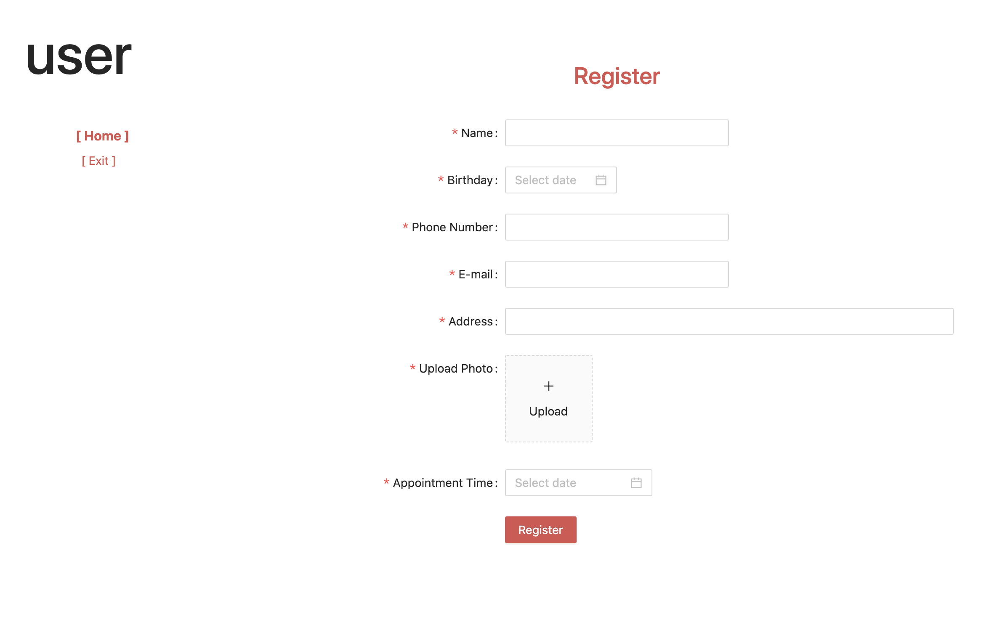

# 病人登记 Demo

## 演示

1. 普通病人账号：user 密码：user
2. 管理员账号：admin 密码：admin

演示网址：[https://demo.msmao.com/medical](https://demo.msmao.com/medical)


## 需求

1. 普通病人登录后，可以登记他们的姓名、生日、手机号码、邮箱账号、居住地址、预约看病时间，以及上传驾驶证照片
2. 管理员登录后，可以看到全部患者的信息

## 截图





## 接口文档

查看 [API 接口](doc/API.md)


## 技术栈

### 后端
1. 开发语言使用 Go 实现
2. 数据库采用 SQLite，简单、轻量级

### 前端
1. 框架采用 React、Umi、Ant Design

### 运维
1. 前、后端分离，各自以 Docker 方式部署至 K8s


## 本地开发

### 后端
安装好 GO 开发、运行环境

```
// 安装依赖
go mod tidy

// 运行 http://localhost:8080 
go run main.go
```
### 前端
安装好 Node.js 开发、运行环境，版本 v12 及以上

```
// 安装依赖
yarn

// 运行 http://localhost:8000 
yarn start
```

### 测试
浏览器访问 [http://localhost:8000 ](http://localhost:8000)

## 注意事项

以下内容在线上环境或正式项目中不可取，因为是演示项目，方便才如此实施

1. 后端应用连同 SQLite 数据库文件、上传的文件资源一同打包至 Docker 运行。在生产环境时，应当独立部署分布式数据库服务，以及持久化静态资源至 OSS、NAS 等分布式存储，便于后期扩展
2. 用户登录、鉴权在前端实现，在正式项目中应当交由请求后端实现相关业务逻辑

